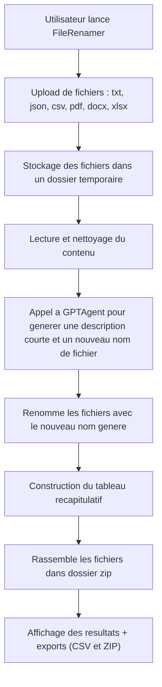
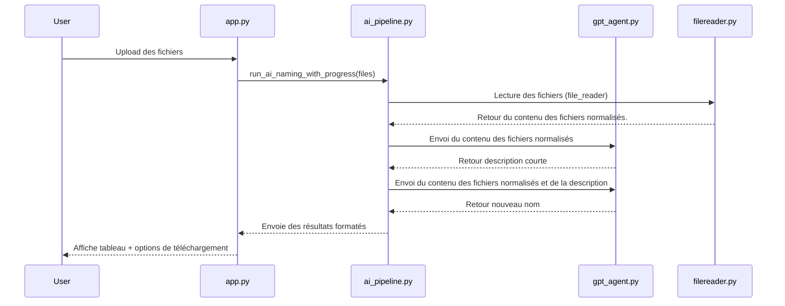

# 📂 AI FileRenamer

**AI FileRenamer** est une application **Streamlit** alimentée par **l’API ChatGPT** qui permet de **renommer automatiquement des fichiers** et de **générer un tableau récapitulatif** contenant :
- le **nom original** du fichier,  
- une **courte description** du contenu,  
- et le **nouveau nom proposé**.  

L’app gère plusieurs formats (txt, json, csv, pdf, docx, xlsx) et inclut une étape de **nettoyage** et **normalisation** avant traitement.

---

## 🚀 Fonctionnalités principales

- 📤 Upload multiple de fichiers (txt, json, csv, pdf, docx, xlsx)
- 🧹 Normalisation automatique des noms (suppression des caractères spéciaux, espaces, etc.)
- 🧽 Nettoyage spécifique des fichiers CSV
- 🧠 Lecture du contenu et génération de **descriptions courtes** via GPT
- 🏷️ Création de **nouveaux noms de fichiers** pertinents
- 📊 Tableau récapitulatif interactif
- 💾 Export des résultats (CSV + ZIP contenant les fichiers renommés)

---

## 🧩 Structure du projet

```YAML
FileRenamer/
│
├── FileRenamer/
│   ├── core/
│   │   ├── ai_pipeline.py          # Pipeline AI : Interface globale (back-end)
│   │   ├── file_reader.py          # Lecture et nettoyage des fichiers
│   │   ├── gpt_agent.py            # Interface avec l’API GPT (OpenAI ou autre)
│   │   └── utils.py                # Fonctions utilitaires (identification des extensions, etc.)
│   │
│   ├── ui/
│   │   ├── app.py                  # Application Streamlit (frontend)
│   │   └── streamlit_helper.py     # Fonctions utilitaires pour l’interface (upload, boutons, etc.)
│
├── requirements.txt                # Dépendances du projet
└── README.md                       # Documentation du projet
```
---

## 🧱 Architecture et fonctionnement

### 🔄 Diagramme global du flux


## 🧠 Diagramme d’interaction des modules



## 🧰 Installation
### 1️⃣ Cloner le dépôt
```
git clone https://github.com/andrealoy/FileRenamer.git
cd FileRenamer
```

### 2️⃣ Créer un environnement virtuel (recommandé)
```bash
conda create -n env python=3.11
conda activate env
```

### 3️⃣ Installer les dépendances
```
pip install -r requirements.txt
```

### 4️⃣ Configurer la clé API OpenAI
```
export OPENAI_API_KEY="sk-xxxxx"   # macOS / Linux
setx OPENAI_API_KEY "sk-xxxxx"     # Windows
```
Note : Si besoin d'une clé OpenAI , nous contacter à notre adresse mail étudiante: (colline.Bousquet@etu.univ-paris1.fr) (andrea.loy@etu.univ-paris1.fr)

## 🖥️ Utilisation
Lancer l’application Streamlit :
```
python -m streamlit run ui/app.py
```
L’application s’ouvre dans votre navigateur à l’adresse : 
👉 **http://localhost:8501**

**Étapes :**
1. Uploader vos fichiers (Pour des exemples : utilisez les fichiers du dossier FileRenamer/examples)
2. Cliquer sur 🚀 Lancer l’analyse
3. L’IA lit les fichiers et génère :
    - une description
    - un nouveau nom
4. Téléchargez :
    - le **CSV** des résultats
    - le **ZIP** contenant les fichiers renommés

## 🧠 Détails techniques

```
core/ai_pipeline.py
```

Pipeline en 4 étapes principales :
1. Lecture du texte (FileReader)
2. Génération de description (GPTAgent.generate_description_text)
3. Proposition de nouveau nom (GPTAgent.generate_filename)
4. Formatage pour l’interface

```
core/file_reader.py
```
- Gère la lecture et le nettoyage des fichiers (txt, csv, pdf, docx, xlsx, json)
- Normalise les noms et les contenus avant envoi à l’IA

```
core/gpt_agent.py
```
- Interface avec l’API ChatGPT
- Génère une courte description et un nom adapté pour chaque fichier

```
ui/app.py
```
- Interface Streamlit
- Gestion de l’upload, affichage des résultats, boutons de téléchargement


## ⚠️ Confidentialité
Les fichiers sont temporairement lus et analysés pour génération de texte.
⚠️ Ne pas uploader de documents sensibles : le contenu est envoyé à l’API GPT pour traitement.

En production, envisagez :
- un anonymiseur de texte
- un modèle local hébergé sur serveur sécurisé (type Gemma via ollama)

## 📦 Export et formats
- **CSV** : liste des noms originaux / descriptions / nouveaux noms
- **ZIP** : contient les fichiers renommés avec les nouveaux noms générés

## 🤝 Contribution
Les contributions sont les bienvenues !
**Suggestions d’améliorations :**
- Support de nouveaux formats
- Tests unitaires étendus
- Possibilité d'utiliser un modèle local ou l'API de OpenAI
- Possibilité de forcer GPT à utiliser une langue

**Pour contribuer :**
- Forker le dépôt
- Créer une branche (feature/ma-feature)
- Commit & push
- Ouvrir une Pull Request

## 📄 Licence
MIT License — libre d’utilisation, modification et distribution.

## 👨🏻‍💻👩🏻‍💻 Auteurs
Développé par Andréa Loy & Colline Bousquet

💡 Basé sur Python, Streamlit et OpenAI GPT API.


